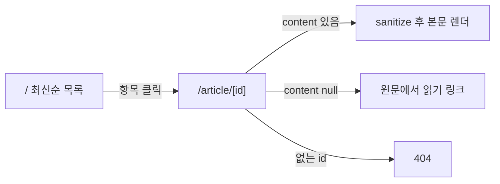

# 리더 UI Spec

> **상태**: In Progress
> **작성일**: 2026-06-03
> **작성**: Claude (프롬프팅: @sikkzz)
> **관련 문서**: [수집 파이프라인 Spec](./feature-collection-pipeline.md), [ADR-0001](../decisions/0001-rss-aggregator-direction.md), [ADR-0007](../decisions/0007-untrusted-html-sanitize.md)

---

## 1. 한 줄 요약

적재된 글을 **목록 → 상세**로 읽는 최소 리더. 상세에서 **본문 전문을 그대로** 보여준다(휴대폰 가독성 우선).

## 2. 배경 / 왜 만드는가

- 수집 파이프라인이 본문을 DB에 채웠지만 **읽을 화면이 없다.** 프로젝트 1순위 가치("출퇴근길 전문 읽기")를 실제로 닫는 단계.
- 저장된 본문(원문 content:encoded / readability 추출물)이 **실제로 읽을 만한지** 화면으로 검증 — 임계값·data-URI 정책 등 파이프라인 튜닝의 피드백 루프.

## 3. 사용자 스토리

- **As a** 개인 사용자, **I want** 모인 글을 최신순 목록으로 훑고, **so that** 읽을 글을 고른다.
- **As a** 개인 사용자, **I want** 글을 누르면 본문 전문을 앱 안에서 읽고, **so that** 원문으로 이동하지 않는다.
- **As a** 개인 사용자, **I want** 본문이 부실하면 원문 링크로 갈 수 있길, **so that** fallback 글도 읽는다.

## 4. 수용 기준 (Acceptance Criteria)

- [ ] `/`에서 모든 글을 **최신순(publishedAt desc, null은 createdAt)** 목록으로 본다. 각 항목: 제목 / 피드명 / 날짜 / 요약(있으면).
- [ ] 목록 항목을 누르면 `/article/[id]` 상세로 이동한다.
- [ ] 상세는 제목 / 피드명 / 작성자 / 날짜 / **원문 링크**를 보여주고, 본문 전문을 렌더한다.
- [ ] 본문 HTML은 **[ADR-0007] sanitize를 거친 뒤** 렌더한다 (script/이벤트핸들러 제거, 코드·이미지·링크 보존).
- [ ] `content`가 null인 글(fallback)은 "원문에서 읽기" 링크를 크게 노출한다.
- [ ] 존재하지 않는 id는 404(notFound).
- [ ] 모바일 폭에서 본문이 넘치지 않는다(이미지/코드블록/표 가로 스크롤 처리).
- [ ] **검색 비노출**: `noindex`(robots) — 개인 이용 제약(PROJECT_ROOT 제약 3).

## 5. 비범위 (Out of Scope)

- 읽음/북마크(`Read` 모델) 토글 — 다음 슬라이스.
- 피드별 필터/카테고리 탭, 검색 — 이후. (무한 스크롤은 후속으로 추가 완료 — Server Action + IntersectionObserver, PAGE_SIZE=30)
- 인증 게이트 — 이후 (지금은 noindex로만).
- 다크모드 정교화, 폰트/타이포 디테일 — 최소만.
- 피드 등록 UI — 별개.

## 6. 화면 / 라우트

| 라우트                                        | 타입             | 내용                                              |
| --------------------------------------------- | ---------------- | ------------------------------------------------- |
| `/` (`app/page.tsx`)                          | Server Component | 최신순 글 목록(초기 limit 100). prisma 직접 쿼리. |
| `/article/[id]` (`app/article/[id]/page.tsx`) | Server Component | 글 상세 + sanitize된 본문. 없으면 `notFound()`.   |

- 데이터 접근: `src/lib/articles.ts` (`getArticleList`, `getArticleById`) — `React.cache`로 요청 내 메모이즈.
- 본문 정화: `src/lib/sanitize.ts` (ADR-0007).
- 두 페이지 모두 `export const dynamic = 'force-dynamic'` — DB 런타임 데이터, 빌드 시 프리렌더(=DB접근) 회피.

## 7. 사용자 플로우

## 8. 테스트 시나리오

| #   | 시나리오                 | 예상 결과                     | 자동화   |
| --- | ------------------------ | ----------------------------- | -------- |
| 1   | `/` 진입                 | 최신순 목록, 80건 노출        | 수동/E2E |
| 2   | content:encoded 글 상세  | 원문 그대로(이미지/코드 보존) | 수동     |
| 3   | readability 추출 글 상세 | 추출 본문 렌더                | 수동     |
| 4   | `<script>` 포함 본문     | 스크립트 제거, 나머지 정상    | 통합     |
| 5   | content null 글          | "원문에서 읽기" 링크          | 수동     |
| 6   | 잘못된 id                | 404                           | 수동     |

## 9. 미정 사안 (Open Questions)

- 목록 정렬/필터: 현재 전체 최신순. 피드별 탭/읽음 숨김은 다음 슬라이스에서.
- 본문 타이포: `@tailwindcss/typography`(prose) vs 직접 CSS 검토 → **CSS Module**(`article-content.module.css`)로 결정. 의존성 0 + globals 오염 0(스코프). 마크다운/노트 등으로 prose가 여러 곳 필요해지면 그때 typography 도입.
- 정화 결과 캐시: 수 MB 본문 매 렌더 정화 비용 — 로컬 실측 4.7MB 글도 ~0.95s라 당장 불필요. 체감 지연 시 도입(ADR-0007).
- **거대 본문 transfer**: 인라인 SVG+base64로 4.7MB인 글은 RSC가 HTML+flight를 중복 직렬화해 ~9.6MB 전송. 대부분 글은 작아 영향 적지만, 이런 outlier는 향후 거대 `data:` URI를 원격화하거나 본문 지연 로드 검토(파이프라인 spec의 저장 한도 미정사안과 연결).

## 10. 변경 이력

| 날짜       | 변경 내용 |
| ---------- | --------- |
| 2026-06-03 | 최초 작성 |
